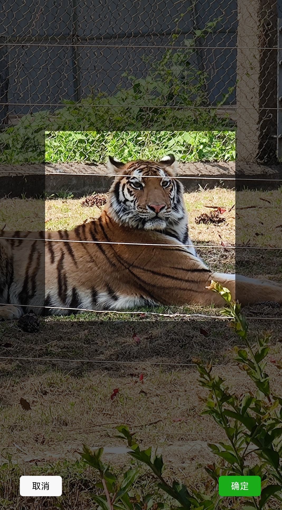
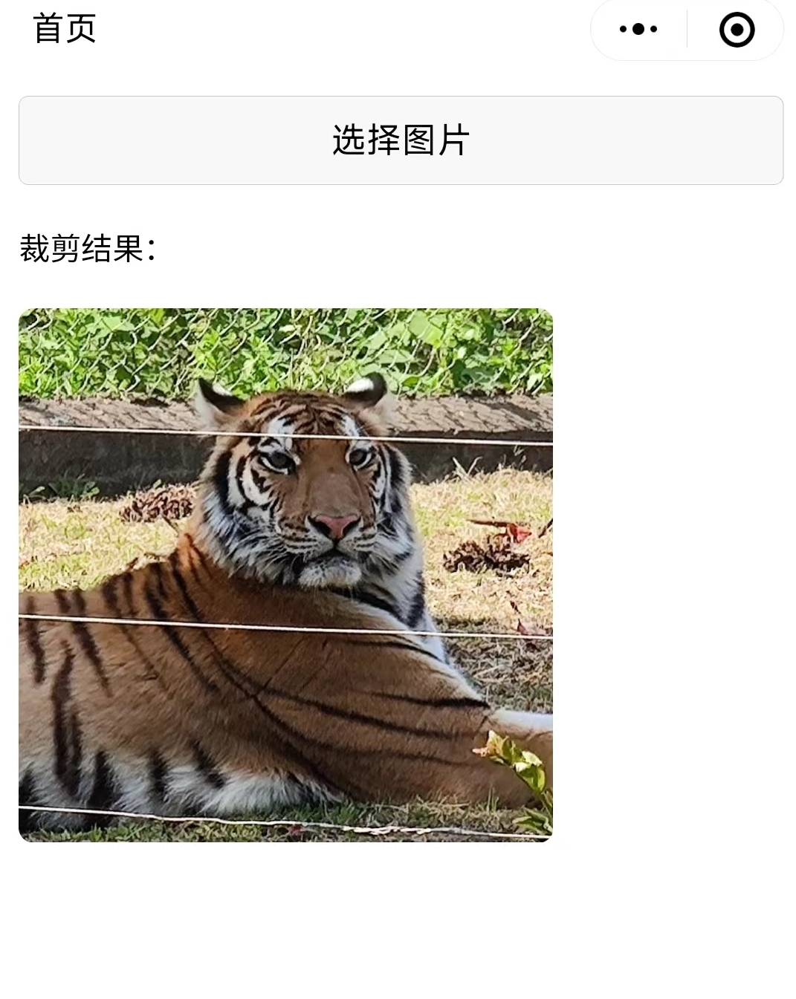

# taro-image-clipper

> 小程序图片裁剪器，基于Taro

## 特点
1. 使用简单，样式简洁
2. 支持图片缩放
3. 支持自定义裁剪框宽高
4. 支持自定义放大倍数
5. 缩放、裁剪流畅

## 效果
<div align:left;display:inline;>


</div>

## 安装

```shell
npm install taro-image-clipper
```

## 引入

```tsx
import { ImageClipper } from 'taro-image-clipper'
```

## 使用

### 基础

```tsx
// 是否展示裁剪器
const [showClipper, setShowClipper] = useState(false)
// 选择的原始图片
const [originalImage, setOriginalImage] = useState("")
// 裁剪后图片
const [clippedImage, setClippedImage] = useState("")

<ImageClipper
  visible={showClipper}
  src={originalImage}
  onCut={(imgPath) => {
    setClippedImage(imgPath)
    setShowClipper(false)
  }}
  onCancel={() => {
    setShowClipper(false)
  }}
/>
```

### 完整使用demo

```tsx
import { View, Button, Image } from "@tarojs/components"
import Taro from "@tarojs/taro"
import { useState } from "react"
import { ImageClipper } from 'taro-image-clipper'

// 图片裁剪使用Demo
export default () => {
  // 是否展示裁剪器
  const [showClipper, setShowClipper] = useState(false)
  // 选择的原始图片
  const [originalImage, setOriginalImage] = useState("")
  // 裁剪后图片
  const [clippedImage, setClippedImage] = useState("")

  return (
    <View >
      <View style={{ padding: '20rpx' }}>
        {/* 选择图片按钮 */}
        <Button
          onClick={() => {
            Taro.chooseImage({
              count: 1,
            }).then((res) => {
              setShowClipper(true)
              setOriginalImage(res.tempFilePaths[0])
            })
          }}
        >
          选择图片
        </Button>
        <View style={{ margin: '20px 0' }}>裁剪结果：</View>
        {/* 裁剪结果展示 */}
        <Image
          src={clippedImage}
          style={{
            borderRadius: "16rpx",
            height: "500rpx",
            width: "500rpx",
          }}
        />
      </View>
      {/* 裁剪组件 */}
      <ImageClipper
        visible={showClipper}
        src={originalImage}
        onCut={(imgPath) => {
          setClippedImage(imgPath)
          setShowClipper(false)
        }}
        onCancel={() => {
          setShowClipper(false)
        }}
      />
    </View>
  )
}

```


## 参数说明


| 参数        | 类型        | 默认值      | 必填  | 说明            |
| :--------- | :--------- | ----------- | :--: | :--------------------- |
|visible           | boolean    |      无     |  是  | 是否展示图片裁剪器  |
|src               | string     |      无     |  是  | 要裁剪的图片       |
|clipperWidth      | number     |      500    |  否  | 裁剪框宽度       |
|clipperHeight     | number     |      500    |  否  | 裁剪框高度        |
|maxScale          | number     |      5      |  否  | 最大放大倍数，maxScale >= 1|
|fileType          | string     |    jpg     |  否  | 裁剪后导出的图片的格式，只支持 'jpg' 或 'png'       |
|quality           | number     |       1     |  否  | 导出图片的质量，取值为 0 ~ 1   |
|clipperCutCanvasId| string     | clipperCutCanvasId |  否  | 用于裁剪的canvas id |
| onCut            | (imgPath: string) => void |  ( ) => { }|  否  | 点击底部的完成按钮，执行裁剪，成功则触发该回调       |
| onCancel         | ( ) => void | ( ) => { } |  否  | 点击取消按钮回调       |


